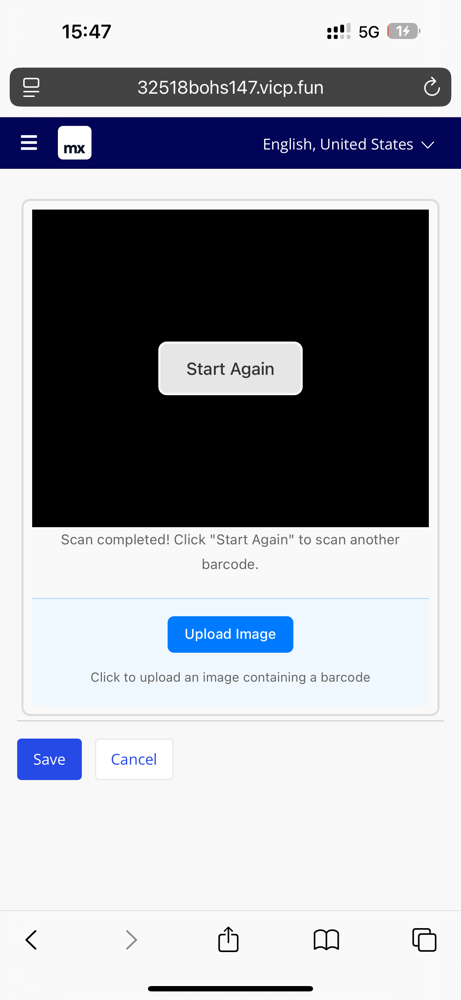
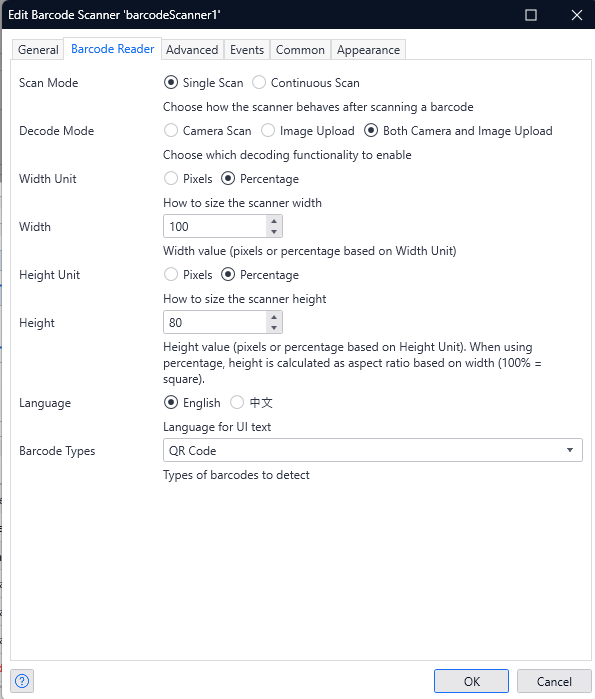

# Mendix Barcode Scanner Widget

A powerful and flexible barcode scanning widget for Mendix applications that supports both camera scanning and image upload functionality using Dynamsoft Barcode Reader SDK.

**Maintained by Zhejiang Lanbojini Knitting Co.,Ltd.**

**Contact**: xie_Jiahong@labull.org.cn

## 📱 Usage

See the widget in action:



## 🚀 Features

- **Dual Scanning Modes**: Camera scanning and image upload
- **Multiple Barcode Types**: QR Code, Code 128, Code 39, EAN-13, EAN-8, UPC-A, UPC-E, PDF417, Data Matrix, Aztec, and more
- **Flexible Sizing**: Configurable width and height in pixels or percentage
- **Scan Modes**: Single scan or continuous scanning
- **Multi-language Support**: English and Chinese (中文)
- **Preload Mode**: Background SDK initialization for better performance
- **Responsive Design**: Mobile-friendly interface
- **Customizable**: Configurable license key and engine resource path

## 📋 Prerequisites

- Mendix Studio Pro 9.0 or higher
- Node.js 16 or higher
- A Dynamsoft license key (free trial available)

## 🛠️ Installation

### 1. Download the Widget

Download the latest widget from the [releases page](https://github.com/YOUR_USERNAME/MendixWidget-BarcodeScanner/releases) or use the widget file from the [assets folder](assets/labull.BarcodeScanner.mpk).

### 2. Import into Mendix

1. Open your Mendix project in Studio Pro
2. Go to **App Store** → **Import Widget**
3. Select the downloaded `.mpk` file
4. Click **Import**

### 3. Add to Your Page

1. Open a page in Studio Pro
2. From the **Toolbox**, find **Barcode Scanner** under **Widgets**
3. Drag it onto your page

## ⚙️ Configuration



### Basic Configuration

#### General Properties
- **Content**: Optional content to display above the scanner
- **Scanned Result Attribute**: String attribute to store the scanned result

#### Barcode Reader Properties
- **Scan Mode**: 
  - `Single Scan`: Stops after detecting one barcode
  - `Continuous Scan`: Keeps scanning for multiple barcodes
- **Decode Mode**:
  - `Camera Scan`: Use device camera
  - `Image Upload`: Upload images for scanning
  - `Both`: Enable both camera and image upload
- **Width/Height**: Configure dimensions in pixels or percentage
- **Language**: Choose between English and Chinese
- **Barcode Types**: Select specific barcode types or use "All Types"

### Advanced Configuration

#### License Setup
- **License Key**: Your Dynamsoft license key
  - Default: `DLS2eyJvcmdhbml6YXRpb25JRCI6IjIwMDAwMSJ9` (trial license)
  - Get your own license at [Dynamsoft](https://www.dynamsoft.com/barcode-reader/sdk-javascript/)

#### Engine Resource Path
- **Engine Resource Path**: URL to Dynamsoft engine files
  - Default: `https://unpkg.com/dynamsoft-javascript-barcode@9.6.42/dist/`
  - You can host your own files for better performance

#### Preload Mode
- **Preload Only**: When enabled, only loads SDK resources without initializing camera
  - Useful for preparing resources in background
  - Reduces initialization time for subsequent scans

### Events

#### On Barcode Detected
- **Action**: Execute when a barcode is successfully detected
- **Parameters**: 
  - `scannedResult` (String): The decoded barcode text

## 🎯 Use Cases

### Inventory Management
- Scan product barcodes for stock updates
- QR code scanning for asset tracking
- Batch scanning with continuous mode

### Event Management
- QR code ticket scanning
- Attendee check-in systems
- Access control with barcode badges

### Retail Applications
- Point of sale barcode scanning
- Product information lookup
- Price checking systems

### Healthcare
- Patient ID scanning
- Medication barcode verification
- Equipment tracking

## 🔧 Development

### Building from Source

1. **Clone the repository**
   ```bash
   git clone https://github.com/yourusername/MendixWidget-BarcodeScanner.git
   cd MendixWidget-BarcodeScanner
   ```

2. **Install dependencies**
   ```bash
   npm install
   ```

3. **Start development server**
   ```bash
   npm start
   ```

4. **Build for production**
   ```bash
   npm run build
   ```

### Project Structure

```
barcodeScanner/
├── src/
│   ├── BarcodeScanner.tsx          # Main widget component
│   ├── BarcodeScanner.xml         # Widget configuration
│   ├── BarcodeScanner.editorConfig.ts  # Editor configuration
│   ├── ui/
│   │   └── BarcodeScanner.css     # Widget styles
│   └── utils/
│       ├── language.ts            # Multi-language support
│       └── sdk.ts                 # Dynamsoft SDK utilities
├── dist/                          # Built widget files
├── package.json                   # Dependencies and scripts
└── README.md                      # This file
```

### Dependencies

- **dynamsoft-javascript-barcode**: 9.6.42 - Core barcode scanning functionality
- **@mendix/pluggable-widgets-tools**: ^10.15.0 - Mendix widget development tools
- **classnames**: ^2.2.6 - CSS class name utilities

## 🌐 Browser Support

- Chrome 60+
- Firefox 55+
- Safari 11+
- Edge 79+
- Mobile browsers (iOS Safari, Chrome Mobile)

## 📝 License

This project is licensed under the Apache License 2.0 - see the [LICENSE](LICENSE) file for details.

## 🤝 Contributing

1. Fork the repository
2. Create a feature branch (`git checkout -b feature/amazing-feature`)
3. Commit your changes (`git commit -m 'Add some amazing feature'`)
4. Push to the branch (`git push origin feature/amazing-feature`)
5. Open a Pull Request

## 🐛 Troubleshooting

### Common Issues

#### Camera Not Working
- **Check browser permissions**: Ensure camera access is allowed
- **HTTPS required**: Camera access requires secure context
- **Check license**: Verify your Dynamsoft license is valid

#### SDK Loading Errors
- **Network issues**: Check if CDN resources are accessible
- **License conflicts**: Ensure license key is correct
- **Browser compatibility**: Verify browser supports required features

#### Performance Issues
- **Use preload mode**: Initialize SDK in background
- **Host your own files**: Use custom engine resource path
- **Optimize barcode types**: Limit to specific barcode formats

### Debug Mode

Enable debug logging by opening browser console. The widget provides detailed logging for:
- SDK initialization
- License validation
- Camera setup
- Barcode detection
- Error handling

## 📞 Support

- **Contact**: xie_Jiahong@labull.org.cn
- **Issues**: [GitHub Issues](https://github.com/YOUR_USERNAME/MendixWidget-BarcodeScanner/issues)
- **Documentation**: [Mendix Documentation](https://docs.mendix.com/)
- **Dynamsoft Support**: [Dynamsoft Documentation](https://www.dynamsoft.com/barcode-reader/docs/)

## 🔄 Version History

### v1.0.0
- Initial release
- Camera scanning support
- Image upload functionality
- Multi-language support
- Responsive design
- Preload mode

## 🙏 Acknowledgments

- [Dynamsoft](https://www.dynamsoft.com/) for providing the excellent barcode scanning SDK
- [Mendix](https://www.mendix.com/) for the platform and widget development tools
- Contributors and users who provide feedback and suggestions
- **Zhejiang Lanbojini Knitting Co.,Ltd.** for maintaining and supporting this widget

---

**Made with ❤️ by Zhejiang Lanbojini Knitting Co.,Ltd. for the Mendix community**

**Contact**: xie_Jiahong@labull.org.cn

---

**About Zhejiang Lanbojini Knitting Co.,Ltd.**: Zhejiang Lanbojini Knitting Co.,Ltd. is a professional garment manufacturing enterprise that integrates men's and women's clothing design, production, and service. With 33 years of expertise in the sweater industry, the company has always adhered to the business philosophy of "integrity, cooperation, and mutual benefit." Relying on superb technology, advanced equipment, strict management, and thoughtful after-sales service, every product design strives for perfection and leads fashion trends. The company has an experienced professional measurement team and a complete set of service concepts for various industries, fully reflecting the design philosophy of "working with customers as one." The company always puts "quality first" at the forefront, with a professional quality department controlling every process. "No defective products, only fine products" is our consistent quality philosophy. The company owns more than 1,300 computerized flat knitting machines from Shima Seiki and Cixing, plus over 1,000 advanced equipment including fully automatic ironing machines, dryers, flat sewing machines, overlock machines, linking machines, and buttonhole machines. With approximately 1,200 employees, from a single yarn to a finished garment, we have a complete production chain with significant price advantages and quality assurance.